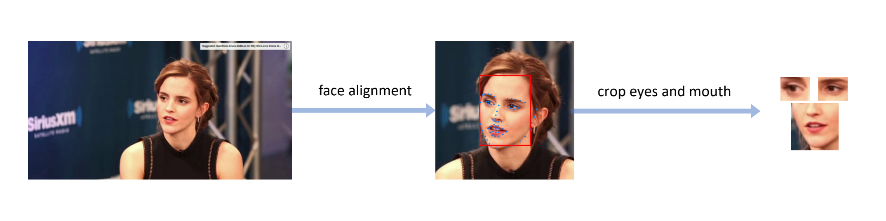

# EyeLipCropper

***EyeLipCropper*** is a Python tool to crop eyes and mouth ROIs of the given video. The whole process consists of three parts: frame extraction, face alignment, and eye/mouth cropping. The cropped eye/mouth image size can be customized.



## Usage

### Prerequisites

```shell
>>> pip install -r requirements.txt
```

### 1. Extract frames of a given video

```shell
>>> python frame_extract.py -h
usage: frame_extract.py [-h] [--video-path VIDEO_PATH] [--images-path IMAGES_PATH]

extract frames with opencv

optional arguments:
  -h, --help            show this help message and exit
  --video-path VIDEO_PATH
                        the input video path
  --images-path IMAGES_PATH
                        the output frames path
 
# default for test: this will generate frames of the video in `./test/images`
>>> python frame_extract.py
```

### 2. Align faces of the frames, with library [face-alignment](https://github.com/1adrianb/face-alignment)

```shell
>>> python face_align.py -h
usage: face_align.py [-h] [--images-path IMAGES_PATH] [--landmarks-path LANDMARKS_PATH] [--boxes-path BOXES_PATH] [--device DEVICE] [--log-path LOG_PATH]

align faces with `https://github.com/1adrianb/face-alignment`

optional arguments:
  -h, --help            show this help message and exit
  --images-path IMAGES_PATH
                        the input frames path
  --landmarks-path LANDMARKS_PATH
                        the output 68 landmarks path
  --boxes-path BOXES_PATH
                        the output bounding boxes path
  --device DEVICE       cpu or gpu cuda device
  --log-path LOG_PATH   logging when there are no faces detected
  
# default for test: this will generate landmarks and bounding boxes in
# `./test/landmarks` and `./test/boxes`
>>> python face_align.py
```

### 3. Crop left eye, right eye, mouth ROIs, with code modified from processing tools of [[Eye] RT-GENE](https://github.com/Tobias-Fischer/rt_gene/tree/master/rt_gene/src/rt_gene) and [[Mouth] LipForensics](https://github.com/ahaliassos/LipForensics/tree/main/preprocessing)

```shell
>>> python eye_mouth_crop.py -h
usage: eye_mouth_crop.py [-h] [--images-path IMAGES_PATH] [--landmarks-path LANDMARKS_PATH] [--boxes-path BOXES_PATH] [--eye-width EYE_WIDTH] [--eye-height EYE_HEIGHT]
                         [--face-roi-width FACE_ROI_WIDTH] [--face-roi-height FACE_ROI_HEIGHT] [--left-eye-path LEFT_EYE_PATH] [--right-eye-path RIGHT_EYE_PATH]
                         [--mean-face MEAN_FACE] [--mouth-width MOUTH_WIDTH] [--mouth-height MOUTH_HEIGHT] [--start-idx START_IDX] [--stop-idx STOP_IDX]
                         [--window-margin WINDOW_MARGIN] [--mouth-path MOUTH_PATH]

crop eye and mouth regions

optional arguments:
  -h, --help            show this help message and exit
  --images-path IMAGES_PATH
                        [COMMON] the input frames path
  --landmarks-path LANDMARKS_PATH
                        [COMMON] the input 68 landmarks path
  --boxes-path BOXES_PATH
                        [EYE] the input bounding boxes path
  --eye-width EYE_WIDTH
                        [EYE] width of cropped eye ROIs
  --eye-height EYE_HEIGHT
                        [EYE] height of cropped eye ROIs
  --face-roi-width FACE_ROI_WIDTH
                        [EYE] maximize this argument until there is a warning message
  --face-roi-height FACE_ROI_HEIGHT
                        [EYE] maximize this argument until there is a warning message
  --left-eye-path LEFT_EYE_PATH
                        [EYE] the output left eye images path
  --right-eye-path RIGHT_EYE_PATH
                        [EYE] the output right eye images path
  --mean-face MEAN_FACE
                        [MOUTH] mean face pathname
  --mouth-width MOUTH_WIDTH
                        [MOUTH] width of cropped mouth ROIs
  --mouth-height MOUTH_HEIGHT
                        [MOUTH] height of cropped mouth ROIs
  --start-idx START_IDX
                        [MOUTH] start of landmark index for mouth
  --stop-idx STOP_IDX   [MOUTH] end of landmark index for mouth
  --window-margin WINDOW_MARGIN
                        [MOUTH] window margin for smoothed_landmarks
  --mouth-path MOUTH_PATH
                        [MOUTH] the output mouth images path

# default for test: this will generate the final cropped left eye,
# right eye, and mouth images in `./test/left_eye`, `./test/right_eye`
# , and `./test/mouth`
>>> python eye_mouth_crop.py
```

* Note that the argument `--face-roi-width` and `--face-roi-height` should be maximized until there is a printed warning.

## License

 [ GPL-3.0 License](https://github.com/zhliuworks/EyeLipCropper/blob/master/LICENSE)

## Reference

**[1]** Bulat, Adrian, and Georgios Tzimiropoulos. "How far are we from solving the 2d & 3d face alignment problem?(and a dataset of 230,000 3d facial landmarks)." *Proceedings of the IEEE International Conference on Computer Vision (ICCV)*. 2017. **GitHub:** https://github.com/1adrianb/face-alignment

**[2]** Fischer, Tobias, Hyung Jin Chang, and Yiannis Demiris. "Rt-gene: Real-time eye gaze estimation in natural environments." *Proceedings of the European Conference on Computer Vision (ECCV)*. 2018. **GitHub:** https://github.com/Tobias-Fischer/rt_gene

**[3]** Haliassos, Alexandros, et al. "Lips Don't Lie: A Generalisable and Robust Approach To Face Forgery Detection." *Proceedings of the IEEE/CVF Conference on Computer Vision and Pattern Recognition (CVPR)*. 2021. **GitHub:** https://github.com/ahaliassos/LipForensics/
